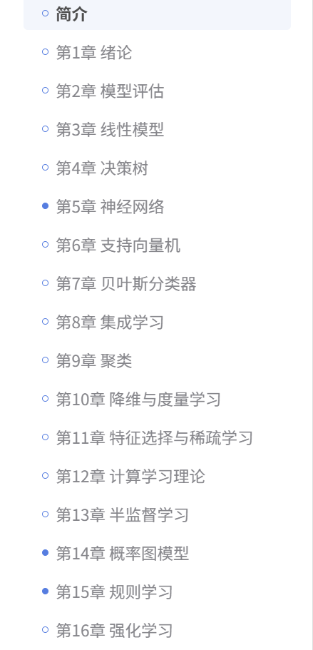
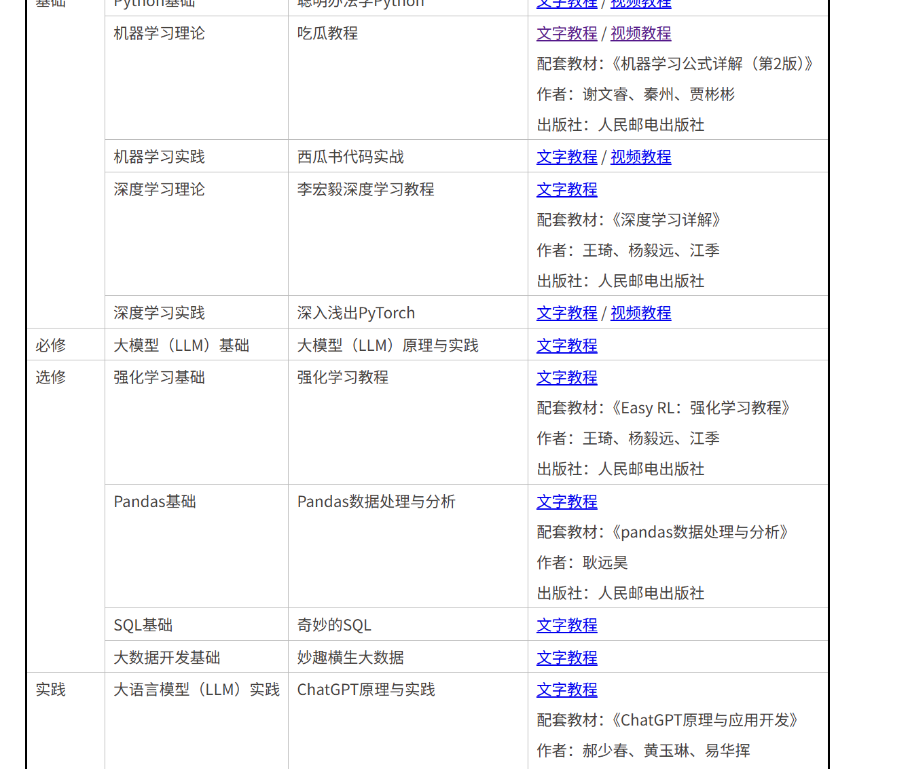

# 一些想学但是还没学的好东西，不要让收藏夹⭐吃灰了！给我学！赚钱！

<!--more-->
# 理论基础
1. [DW 机器学习-南瓜书🎃](https://www.datawhale.cn/learn/content/2/62) 
————[配套的B站教程](https://www.bilibili.com/video/BV1Mh411e7VU/?vd_source=2d76796757e78dafed9e8a5c75308ea8&spm_id_from=333.788.videopod.episodes&p=3)：西瓜书🍉的简易版

2. [DW 人工智能培养方案](https://www.datawhale.cn/learn/summary/40)

3. [深度学习的知识合集网站](https://www.rethink.fun/)

4. ① [强化学习教程 - 磨菇书🍄](https://github.com/datawhalechina/easy-rl)
 ② [easy-rl在线阅读](https://datawhalechina.github.io/easy-rl/#/chapter1/chapter1?id=_11-%e5%bc%ba%e5%8c%96%e5%ad%a6%e4%b9%a0%e6%a6%82%e8%bf%b0)：还有苹果书🍎

5. [self-llm 项目实战](https://github.com/datawhalechina/self-llm/tree/master)
# B站up主
1. [清华读研](https://space.bilibili.com/478929155?spm_id_from=333.788.upinfo.head.click)

# 细分领域
## 模型下载
国内：
1. [魔搭社区ModelScope模型库](https://www.modelscope.cn/models)：牛逼
2. [阿里EasyNLP](https://github.com/alibaba/EasyNLP/tree/master)：这个更NLP，有BERT什么的
3. [百度飞浆PeddlePeddle的模型库](https://aistudio.baidu.com/modelsoverview?lang=zh_CN)：没有魔搭好
4. [文心ERNIEKIT专用](https://aistudio.baidu.com/projectdetail/9349901)：只有ERNIE系列模型，要用才用这个

国外：
1. [Huggingface](https://huggingface.co/models)：权威啊

## RAG
1. [同济的RAG-Survey教程](https://github.com/Tongji-KGLLM/RAG-Survey?tab=readme-ov-file#what--is-)

# 项目
岗位分类应用算法型、研究型

Agent/RAG > 微调 > 

# 捞捞



